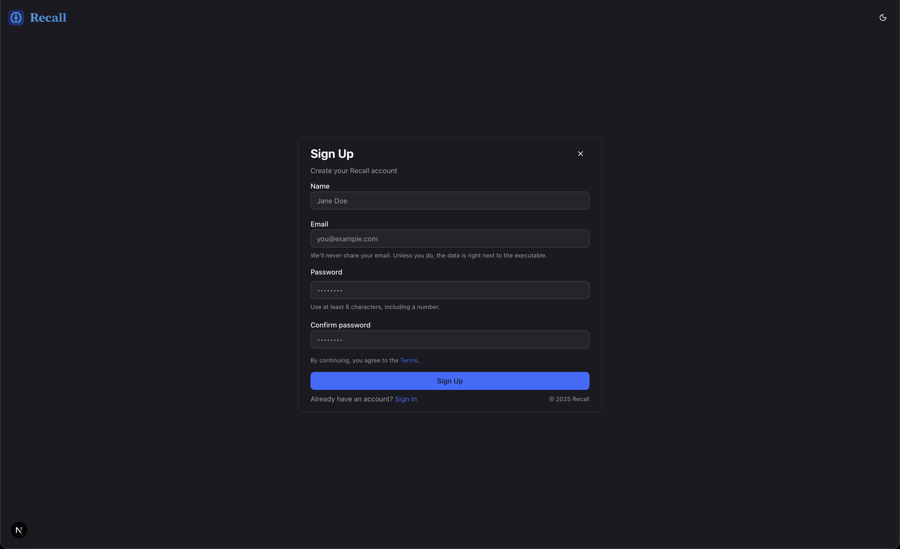
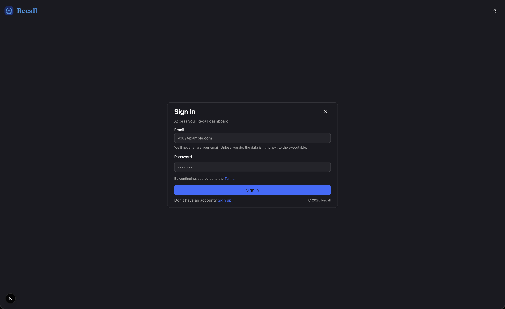
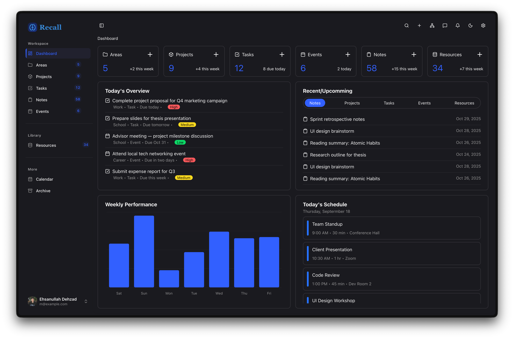

# Recall

A personal knowledge base built with [Tauri](https://tauri.app/) and [Next.js](https://nextjs.org/). Recall helps you organize your areas, projects, tasks, and resources in a beautiful, local-first desktop application.

## Pre-built Releases

You can download the pre-built releases from the [Releases](/releases) page. They may be labeled as "draft" but should run on the following platforms:

- macOS (Arm64) with `.app` inside the `.tar.gz` (`.dmg` is not supported yet)

```zsh
# Extract the .tar.gz file
tar -xzf recall.app.tar.gz

# macOS is known to quarantine the app because I didn't spend $99 to get a developer account
xattr -c recall.app

# If it still doesn't open, you can try: (or switch to linux or windows)
./recall.app/Contents/MacOS/recall
```

- Linux (x64) with `.AppImage`, `.deb`, and `.rpm`

```bash
# Ubuntu (other distros like Debian should work but I haven't tested them)
sudo apt update
sudo apt install ./recall_0.1.0_amd64.deb
./recall
```

- Windows (x64) with `.msi`, and `.exe`.

## Tech Stack

- **Frontend**: Next.js 15, React 19, TypeScript
- **Backend**: Tauri 2 (Rust)
- **Database**: SQLite with `rusqlite` and `exemplar`
- **UI**: Tailwind CSS, Radix UI, Shadcn UI, Shadcn.io
- **Editor**: TipTap (rich text editor)
- **Package Manager**: Bun

## Prerequisites

- [Rust](https://www.rust-lang.org/tools/install) (latest stable version)
- [Bun](https://bun.sh/) (MUST BE BUN v1.3 or higher)
- System dependencies for Tauri:
  - **macOS**: Xcode Command Line Tools
  - **Linux**: `libwebkit2gtk-4.1-dev`, `libappindicator3-dev`, `librsvg2-dev`, `patchelf`
  - **Windows**: Microsoft Visual Studio C++ Build Tools

## Getting Started

### 1. Install Dependencies

```bash
bun install
```

### 2. Development

Run the Tauri development server:

```bash
bun run tauri dev
```

This will:

- Start the Next.js development server on `http://localhost:3000`
- Build and launch the Tauri application
- Enable hot-reload for both frontend and backend changes

### 3. Building for Production

Build the frontend:

```bash
bun run build
```

Build the Tauri application:

```bash
bun run tauri build
```

The built application will be in `src-tauri/target/release/bundle/`:

- **macOS**: `.app` bundle inside the `.tar.gz`
- **Windows**: `.msi` installer and `.exe` setup executable
- **Linux**: `.AppImage`, `.deb`, and `.rpm` (only `.deb` was tested on Ubuntu)

## Features

<!-- 
 -->

| Signup                 | Signin                 | Dashboard              |
|------------------------|------------------------|------------------------|
|  |  | 


- 🔐 **Authentication**: Username/password authentication with secure token management
- 📁 **Areas**: Organize your work into different areas
- 📋 **Projects**: Manage projects within areas with kanban-style boards
- 📄 **Resources**: Store documents and files (text editor or file uploads)
- 🎨 **Modern UI**: Beautiful, responsive interface built with Shadcn UI
- 💾 **Local-First**: All data stored locally in SQLite database
- 🔒 **Privacy**: No data leaves your device

## Database

The database file (`recall.db`) is stored locally in the application directory. Note that the database is not encrypted yet, so please be careful with your data. Final version will have some encryption but "never trust the client" principle applies because I can't guarantee someone in your household won't steal your data.

## License

Since this is purely a educational project, I'm not going to enforce any license.

See the [Terms of Service](TERMS.md) for licensing information.
